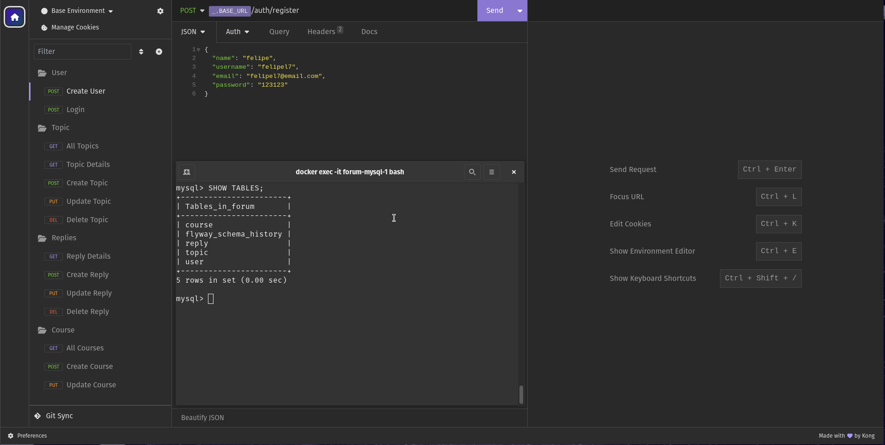
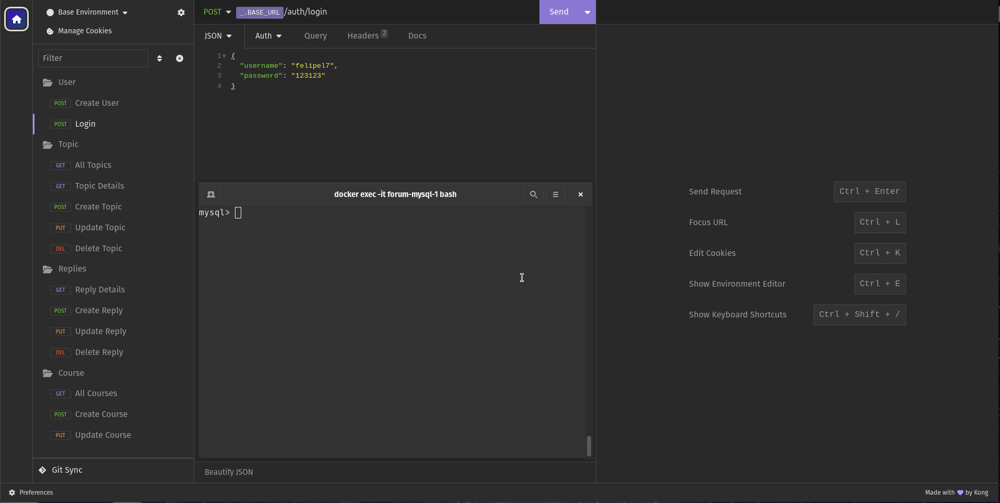
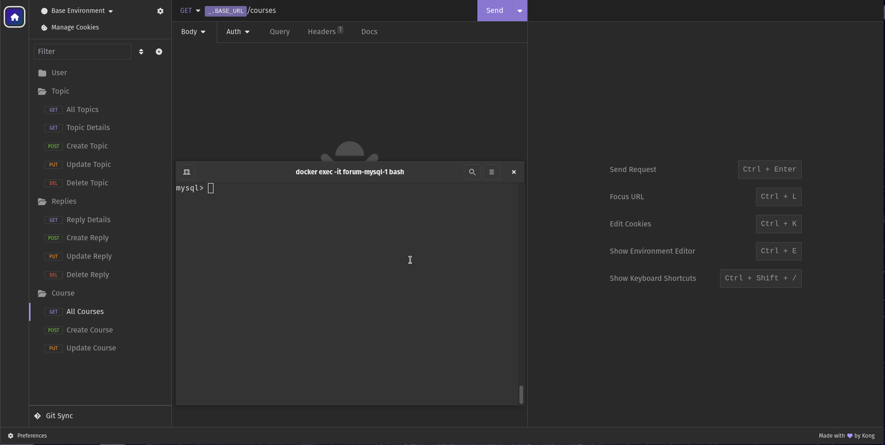
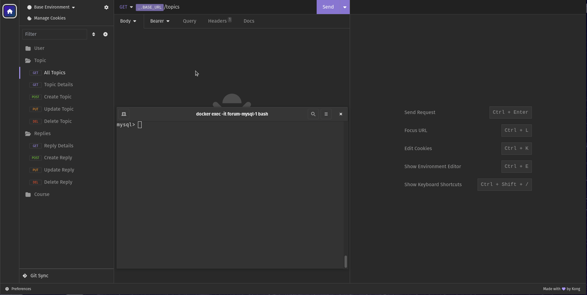
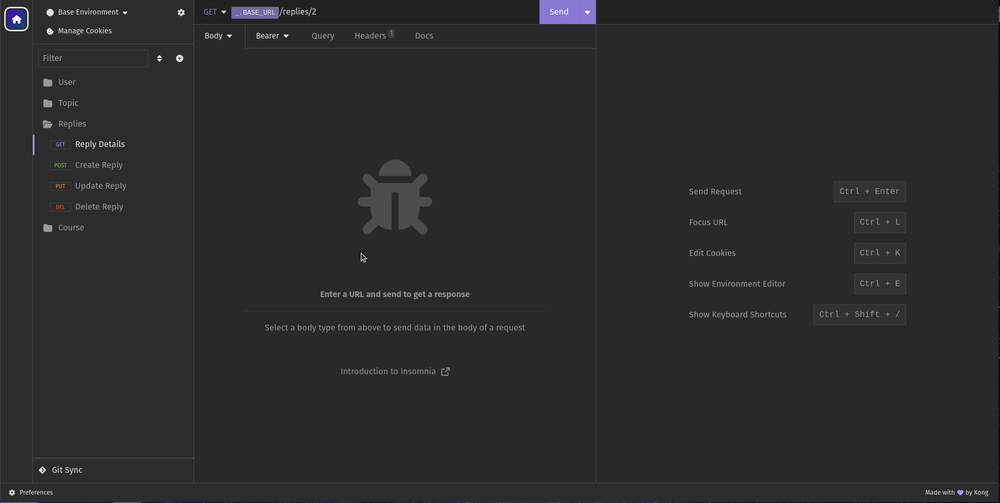
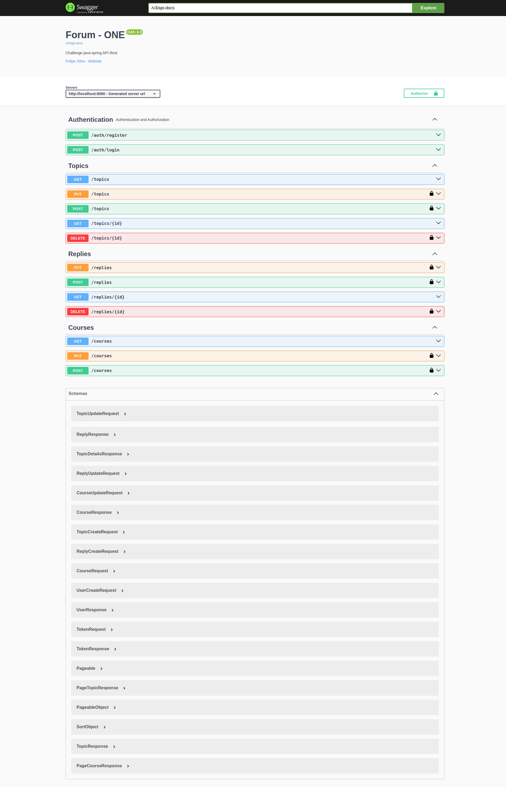

# FórumHub Challenge

Esta API foi construída durante o programa de formação da ONE-Oracle Next Education, turma 6.

<br />

## Resumo

O FórumHub é uma API desenvolvida em Java com Spring Boot. Na API, você pode realizar operações de:

- CRUD de cursos
- CRUD de tópicos
- CRUD de respostas

Além disso, os usuários podem se cadastrar. As rotas protegidas para **usuários autenticados** incluem operações que
envolvem `POST`, `PUT` e `DELETE`.

<br />

### Demonstração

- Registro de usuário:
  

  Não é possível cadastrar usuário com o mesmo **_username_** ou **_email_**.

<br />

- Login de usuário:
  

  _Token expira após 1 hora_.

<br />

- CRU~~D~~ de cursos:
  

<br />

- CRUD de tópicos:
  

  _Implementei deleção lógica somente para tópicos_.

<br />

- CRUD de respostas:
  

<br />

- Documentação:
    

<br />
<br />

### Tecnologias Utilizadas

- Java _17_
- Spring Boot
- Spring Data JPA
- Docker
- MySql
- Spring Security
- Spring Validation
- Spring Web
- Flyway (para migrações de banco de dados)
- Lombok
- Spring Boot DevTools
- Java JWT (Auth0)
- Springdoc OpenAPI

<br />
<br />

### Executando o projeto localmente

1. **Pré-requisitos:**
    - Certifique-se de ter o Docker e o Docker Compose instalados.

<br />

2. **Clone o Repositório:**
    - Clone o repositório do FórumHub:
      ```
      git clone git@github.com:felipel7/challenge-java-forum.git
      ```

<br />

3. **Configuração do Banco de Dados:**
    - Navegue até o diretório do projeto clonado.
    - Execute o comando `docker compose up -d` para iniciar o contêiner do mysql.
    - Após o contêiner estar em execução, abra um terminal e execute o comando:
      ```
      docker exec -it forum-mysql-1 bash
      ```
    - Dentro do contêiner, execute o comando:
      ```
      mysql -u root -p
      ```
      _A senha foi definida como **root** no `application.properties`_
    
    - No prompt do mysql, crie o banco de dados FórumHub com o comando:
      ```
      CREATE DATABASE forum;
      ```

<br />

4. **Execução da Aplicação:**
    - Após configurar o banco de dados, você pode executar a aplicação Java normalmente.

<br />

5. **Documentação:**
    - Após rodar a API, teste e acesse a documentação através link local: http://localhost:8080/swagger-ui/index.html.


<br />
<br />

Feito com carinho ♡ por Felipe Silva :)